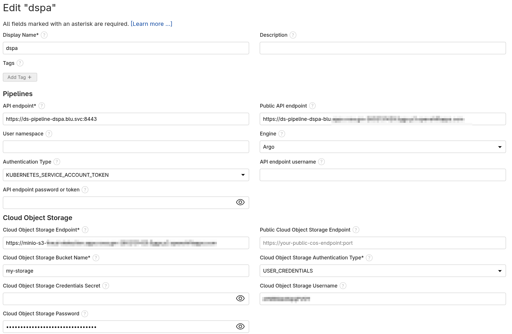

# Prepare Elyra deployment

Inside Jupiter editor:

1. **Select** `Runtimes` from left vertical bar, then **create** a new runtime and fill the information like in the following screenshot:

    

2. **Select** `Runtimes images` from left vertical bar, then **create** a new runtime image and fill the following information:

    - In **Display Name** field enter `cpu-py312-rhel9-blu` (this name must match the content in the pipeline)

    - In **Image Name** field enter the image URL in the local registry: `image-registry.openshift-image-registry.svc:5000/blu/odh-pipeline-runtime-datascience-cpu-py312-rhel9-blu:v1.0`

      > [!TIP]
      > Use the following command to list image URL and tags: `oc get is`